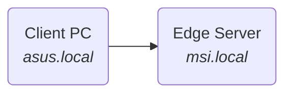
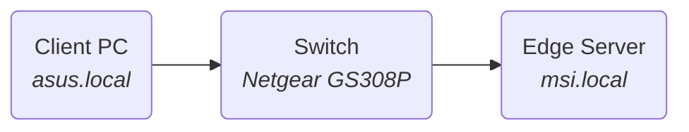

# Bandwidth test 

The bandwidth test is performed with the *iperf3* tool. The tests will be started from the receiver machine (Edge Server) for convenience purposes.
A *iperf3 server node* is started on the sender machine and a *client node* with the test configurations is started on the receiver. This is opposite the default direction *iperf3* uses, so the option *-R* or *--reverse* must be used.

### Direct connection

**iperf3 --reverse --client=asus.local --zerocopy --udp --bitrate=1G --time=4 --ommit=2**
@import "0-direct_udp.log"

**iperf3 --reverse --client=asus.local --zerocopy --time=4 --ommit=2**
@import "0-direct_tcp.log"
 

<!--> <!-->
### Off the shelf switch

**iperf3 --client=asus.local --zerocopy --udp --bitrate=1G --time=4 --ommit=2**
@import "0-netgear_udp.log"

**iperf3 --client=asus.local --zerocopy --time=4 --ommit=2**
@import "0-netgear_tcp.log"