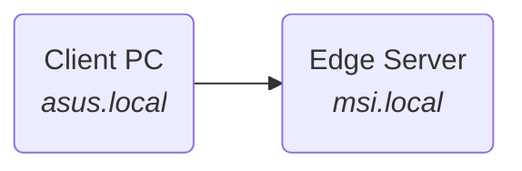
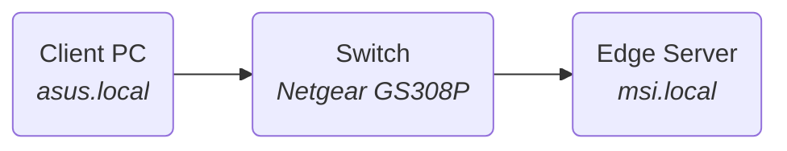
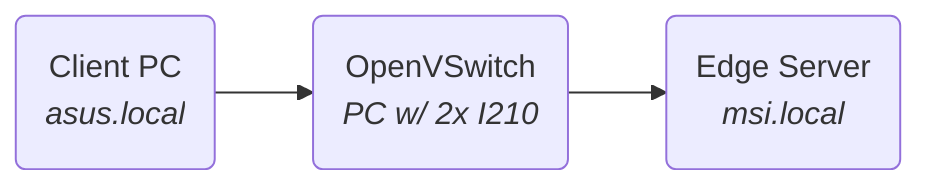
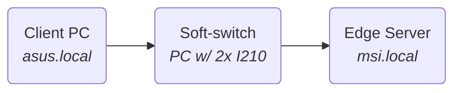

# Bandwidth test 

The bandwidth test is performed with the *iperf3* tool. The tests will be started from the receiver machine (Edge Server) for convenience purposes.
A *iperf3 server node* is started on the sender machine and a *client node* with the test configurations is started on the receiver. This is opposite the default direction *iperf3* uses, so the option *-R* or *--reverse* must be used. To minimize latency and jiter a *zero copy* method is used to tranfer the data between the process and the *NIC*, this technique avoids system calls and takes advantage of the DMA functionality of the CPU.

In order to minimize the OS-originated jitter, the process priorities of the nodes can be increased. The command below starts a new bash session with the maximum priority allowed in userspacem the processes started from there will benefit from the privileges.

```bash
$ sudo nice -n -20 bash
```
On the sender pc a server node is started:
```bash
$ iperf3 --server
```
<br>

### Direct connection


**$ iperf3 --reverse --client=asus.local --zerocopy --udp --bitrate=1G --time=4 --omit=2**
@import "iperf3_logs/1-direct_udp.log"

**$ iperf3 --reverse --client=asus.local --zerocopy --time=4 --omit=2**
@import "iperf3_logs/1-direct_tcp.log"
<br>


<!--> <!-->
### Off the shelf switch


**$ iperf3 --client=asus.local --zerocopy --udp --bitrate=1G --time=4 --omit=2**
@import "iperf3_logs/1-netgear_udp.log"

**$ iperf3 --client=asus.local --zerocopy --time=4 --omit=2**
@import "iperf3_logs/1-netgear_tcp.log"
<br>


<!--> <!-->
### OpenVSwitch

**$ iperf3 --client=asus.local --zerocopy --udp --bitrate=1G --time=4 --omit=2**
@import "iperf3_logs/1-ovs_udp.log"

**$ iperf3 --client=asus.local --zerocopy --time=4 --omit=2**
@import "iperf3_logs/1-ovs_tcp.log"
<br>


<!--> <!-->
### Linux Bridge


**$ iperf3 --client=asus.local --zerocopy --udp --bitrate=1G --time=4 --omit=2**
@import "iperf3_logs/1-linuxbr_udp.log"

**$ iperf3 --client=asus.local --zerocopy --time=4 --omit=2**
@import "iperf3_logs/1-linuxbr_tcp.log"
<br>


<!--> <!-->
### Linux Bridge with shapers and filters
The configuration files can fe found in ```./1-switch/```
On the sender pc a server node is started:
```bash
$ iperf3 --server -port 5207
```

#### CBS with hardware offload
**$ iperf3 --client=asus.local --zerocopy --udp --bitrate=1G --time=4 --omit=2 --port=5207**
@import "iperf3_logs/1-shaper_hw_udp.log"

**$ iperf3 --client=asus.local --zerocopy --time=4 --omit=2 --port=5207**
@import "iperf3_logs/1-shaper_hw_tcp.log"
<br>

#### CBS in software
**$ iperf3 --client=asus.local --zerocopy --udp --bitrate=1G --time=4 --omit=2 --port=5207**
@import "iperf3_logs/1-shaper_sw_udp.log"

**$ iperf3 --client=asus.local --zerocopy --time=4 --omit=2 --port=5207**
@import "iperf3_logs/1-shaper_sw_tcp.log"
<br>

#### TAS in software
**$ iperf3 --client=asus.local --zerocopy --udp --bitrate=1G --time=4 --omit=2 --port=5207**
@import "iperf3_logs/1-tas_sw_udp.log"

**$ iperf3 --client=asus.local --zerocopy --time=4 --omit=2 --port=5207**
@import "iperf3_logs/1-tas_sw_tcp.log"
<br>
