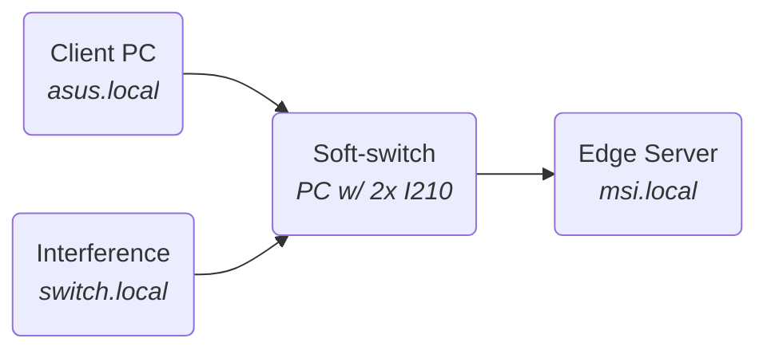

# TSN use case

The bandwidth test is performed with the *iperf3* tool. The tests will be started from the receiver machine (Edge Server) for convenience purposes.
A *iperf3 server node* is started on the sender machines and a *client node* with the test configurations is started on the receiver. This is opposite the default direction *iperf3* uses, so the option *-R* or *--reverse* must be used. To minimize latency and jiter a *zero copy* method is used to tranfer the data between the process and the *NIC*, this technique avoids system calls and takes advantage of the DMA functionality of the CPU.

In order to minimize the OS-originated jitter, the process priorities of the nodes can be increased. The command below starts a new bash session with the maximum priority allowed in userspacem the processes started from there will benefit from the privileges.

```bash
$ sudo nice -n -20 bash
```
The bottleneck is a 1G-base-T link.
The high priority traffic will have allocated an arbitrary bandwidth of 600 Mbps.
The interference traffic will have allocated an arbitrary bandwidth of 500 Mbps.

Notice that the sum of the bandwidths is greater than 100% of the link capability. Is is expected for the High priority traffic to have it's specified bw and the interference to have the remaining (1 Gbps - 600 Mbps = 400 Mbps).

On the main sender pc a server node is started: ```$ iperf3 --server --port=5205```
On the interference node a server node is started: ```$ iperf3 --server --port=5203```
Only UDP packets will be used for this test.
For the interference, it will be used the same pc that implements the switch because availability limitations. Since the pc has hight performance hardware, performance shouldn't be affected in any significant way.
The shaper and filter configuration files can fe found in ```./3-switch/```
<br>



### Best effort approach
In this test no traffic shaping is used.

**$ iperf3 --reverse --client=asus.local   --zerocopy --udp --bitrate=1G --time=4 --omit=2 --cport=5205 --port=5205 &\\
    iperf3 --reverse --client=switch.local --zerocopy --udp --bitrate=1G --time=4 --omit=2 --cport=5203 --port=5203**
Class 5:
@import "iperf3_logs/3-best_effort_PC.log"
Class 3:
@import "iperf3_logs/3-best_effort_noise.log"


### CBS with hardware offload
#### Only class 3
**$ iperf3 --reverse --client=switch.local --zerocopy --udp --bitrate=1G --time=4 --omit=2 --cport=5203 --port=5203**
@import "iperf3_logs/3-cbs_hw_onlyC3.log"

#### Traffic adjusted to 956 Mbps link
**$ iperf3 --reverse --client=switch.local --zerocopy --udp --bitrate=1G --time=4 --omit=2 --cport=5203 --port=5203**
@import "iperf3_logs/3-cbs_hw_onlyC3_956Mbps.log"

#### Only class 3 + class 5

**$ iperf3 --reverse --client=asus.local   --zerocopy --udp --bitrate=1G --time=4 --omit=2 --cport=5205 --port=5205 &\\
    iperf3 --reverse --client=switch.local --zerocopy --udp --bitrate=1G --time=4 --omit=2 --cport=5203 --port=5203**
Class 5:
@import "iperf3_logs/3-cbs_hw_C5.log"
Class 3:
@import "iperf3_logs/3-cbs_hw_C3.log"

### CBS in Software

**$ iperf3 --reverse --client=asus.local   --zerocopy --udp --bitrate=1G --time=4 --omit=2 --cport=5205 --port=5205 &\\
    iperf3 --reverse --client=switch.local --zerocopy --udp --bitrate=1G --time=4 --omit=2 --cport=5203 --port=5203**
Class 5:
@import "iperf3_logs/3-cbs_sw_C5.log"
Class 3:
@import "iperf3_logs/3-cbs_sw_C3.log"


### TAS in Software
**$ iperf3 --reverse --client=asus.local   --zerocopy --udp --bitrate=1G --time=4 --omit=2 --cport=5205 --port=5205 &\\
    iperf3 --reverse --client=switch.local --zerocopy --udp --bitrate=1G --time=4 --omit=2 --cport=5203 --port=5203**

#### 100ns cycle time
Class 5:
@import "iperf3_logs/3-tas_sw_C5_100ns.log"
Class 3:
@import "iperf3_logs/3-tas_sw_C3_100ns.log"

#### 1ms cycle time
Class 5:
@import "iperf3_logs/3-tas_sw_C5_1ms.log"
Class 3:
@import "iperf3_logs/3-tas_sw_C3_1ms.log"

#### 10ms cycle time

Class 5:
@import "iperf3_logs/3-tas_sw_C5_10ms.log"
Class 3:
@import "iperf3_logs/3-tas_sw_C3_10ms.log"

#### 100ns cycle time
Class 5:
@import "iperf3_logs/3-tas_sw_C5_100ms.log"
Class 3:
@import "iperf3_logs/3-tas_sw_C3_100ms.log"

