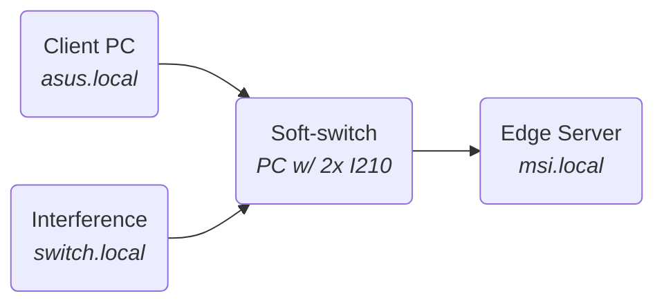

# TSN use case

The bandwidth test is performed with the *iperf3* tool. The tests will be started from the receiver machine (Edge Server) for convenience purposes.
A *iperf3 server node* is started on the sender machines and a *client node* with the test configurations is started on the receiver. This is opposite the default direction *iperf3* uses, so the option *-R* or *--reverse* must be used. To minimize latency and jiter a *zero copy* method is used to tranfer the data between the process and the *NIC*, this technique avoids system calls and takes advantage of the DMA functionality of the CPU.

In order to minimize the OS-originated jitter, the process priorities of the nodes can be increased. The command below starts a new bash session with the maximum priority allowed in userspacem the processes started from there will benefit from the privileges.

```bash
$ sudo nice -n -20 bash
```
On the main sender pc a server node is started: ```$ iperf3 --server --port=5205```
On the interference node a server node is started: ```$ iperf3 --server --port=5203```
Only UDP packets will be used for this test.
For the interference, it will be used the same pc that implements the switch because availability limitations. Since the pc has hight performance hardware, performance shouldn't be affected in any significant way.
<br>

### Best effort approach



**$ iperf3 --client=asus.local --zerocopy --udp --bitrate=1G --time=4 --omit=2**
@import "iperf3_logs/3-best_effort.log"


