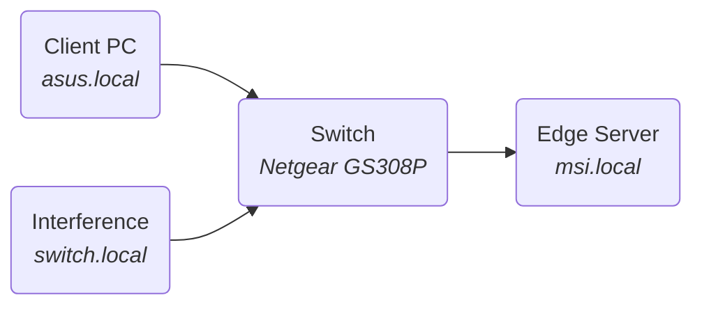

# Distributed TSN-like shaping

In this use-case instead of using a TSN compliant switch, a distributed approach will be tested. The shping algorithms will be instantiated in each egress port of each end device, and a ordinary off-the-shelf switch will be used for bridging purposes.
Because the ordinary switch is not compliant with the PTP TSN profile, a PTPv2 configuration with the End-to-End delay calculation and OSI Layer-4 transport will be used.

The bottleneck is a 1G-base-T link.
The high priority traffic will have allocated an arbitrary bandwidth of 600 Mbps.
The interference traffic will have allocated an arbitrary bandwidth of 500 Mbps.

Notice that the sum of the bandwidths is greater than 100% of the link capability. Is is expected for the High priority traffic to have it's specified bw and the interference to have the remaining (1 Gbps - 600 Mbps = 400 Mbps).

On the main sender pc a server node is started: ```$ iperf3 --server --port=5205```
On the interference node a server node is started: ```$ iperf3 --server --port=5203```
Only UDP packets will be used for this test.
For the interference, it will be used the same pc that implements the switch because availability limitations. Since the pc has hight performance hardware, performance shouldn't be affected in any significant way.
The shaper and filter configuration files can fe found in ```./4-scripts/```
<br>




### Best effort approach
In this test no traffic shaping is used.

#### Excess bandwidth: 600 Mbps + 500 Mbps
**$ iperf3 --reverse --client=asus.local   --zerocopy --udp --bitrate=1G --time=4 --omit=2 --cport=5205 --port=5205 &\\
    iperf3 --reverse --client=switch.local --zerocopy --udp --bitrate=1G --time=4 --omit=2 --cport=5203 --port=5203**
Class 5:
@import "iperf3_logs/4-best_effort_C5.log"
Class 3:
@import "iperf3_logs/4-best_effort_C3.log"


### CBS distributed

#### Excess bandwidth: 600 Mbps + 500 Mbps
**$ iperf3 --reverse --client=asus.local   --zerocopy --udp --bitrate=1G --time=4 --omit=2 --cport=5205 --port=5205 &\\
    iperf3 --reverse --client=switch.local --zerocopy --udp --bitrate=1G --time=4 --omit=2 --cport=5203 --port=5203**
Class 5:
@import "iperf3_logs/4-dist_CBS_C5.log"
Class 3:
@import "iperf3_logs/4-dist_CBS_C3.log"


#### Low bandwidth: 400 Mbps + 300 Mbps
**$ iperf3 --reverse --client=asus.local   --zerocopy --udp --bitrate=1G --time=4 --omit=2 --cport=5205 --port=5205 &\\
    iperf3 --reverse --client=switch.local --zerocopy --udp --bitrate=1G --time=4 --omit=2 --cport=5203 --port=5203**
Class 5:
@import "iperf3_logs/4-700mbps_dist_CBS_C5.log"
Class 3:
@import "iperf3_logs/4-700mbps_dist_CBS_C3.log"


### CBS in switch

#### Excess bandwidth: 600 Mbps + 500 Mbps
**$ iperf3 --reverse --client=asus.local   --zerocopy --udp --bitrate=1G --time=4 --omit=2 --cport=5205 --port=5205 &\\
    iperf3 --reverse --client=switch.local --zerocopy --udp --bitrate=1G --time=4 --omit=2 --cport=5203 --port=5203**
Class 5:
@import "iperf3_logs/4-CBS_C5.log"
Class 3:
@import "iperf3_logs/4-CBS_C3.log"


#### Low bandwidth: 400 Mbps + 300 Mbps
**$ iperf3 --reverse --client=asus.local   --zerocopy --udp --bitrate=1G --time=4 --omit=2 --cport=5205 --port=5205 &\\
    iperf3 --reverse --client=switch.local --zerocopy --udp --bitrate=1G --time=4 --omit=2 --cport=5203 --port=5203**
Class 5:
@import "iperf3_logs/4-700mbps_CBS_C5.log"
Class 3:
@import "iperf3_logs/4-700mbps_CBS_C3.log"


