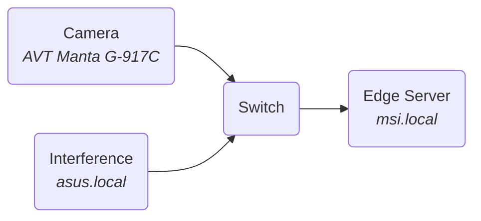

# Video QoS

In this usecase a industrial vision scenario will be tested. 

A Allied Vision Manta G917C camera will be used. This device, streams uncomoressed video at a maximum resolution of 3384x2710 pixels with a bitdephth up to 12-bit. In 8-bit mode and full resolution the camera transmits 6255 ethernet packets of 1514 bytes per frame, which adds up to about 10 Mbytes in total, this requires a bandwidth of aproximately 80 Mbps per unit of frame rate.
The device is not TSN compliant as it's PTPv2 implementation does not support the peer-delay delay calculation machanism and only implements the path-delay method. The camera also doen't append the VLAN tag to the ethernet header.

        HeightMax:               2710 pixels
        WidthMax:                3384 pixels
        AcquisitionFrameRateAbs: 10.1616 fps

        image size: 9170640 Bytes
        packets per frame: 6255+1
        burst size: ~10 MBytes
        average bandwidth: ~80 Mbps/fps

The bottleneck is a 1G-base-T link.

The camera will be setup to stream 10 frames per second, requiring about 800 Mbps of bandwidth.
The interference traffic will have allocated an arbitrary bandwidth of 150 Mbps.

On the interference node a server node is started: ```$ iperf3 --server --port=5201```
Only UDP packets will be used for this test.
The shaper and filter configuration files can fe found in ```./5-scripts/```
<br>




### Best effort approach
In this test no traffic shaping is used.

#### Baseline: Only camera
**$ vimbaperf --index=0 --stealth --frameRate=10 --binning=1 --time=10 &\
iperf3 --reverse --client=asus.local   --zerocopy --udp --bitrate=1G --time=10 --omit=2 --cport=5201 --port=5201**

Camera:
@import "logs/5-baseline_cam.log"

#### Camera plus unbounded interference
In this test the interference is set to 1 Gbps.
**$ vimbaperf --index=0 --stealth --frameRate=10 --binning=1 --time=10 &\
iperf3 --reverse --client=asus.local   --zerocopy --udp --bitrate=1G --time=10 --omit=2 --cport=5201 --port=5201**

Camera:
@import "logs/5-BE_cam.log"
Interference:
@import "logs/5-BE_C1.log"

#### Camera plus bounded interference
In this test the interference is set to 150 Mbps.

**$ vimbaperf --index=0 --stealth --frameRate=10 --binning=1 --time=10 &\
iperf3 --reverse --client=asus.local   --zerocopy --udp --bitrate=100M --time=10 --omit=2 --cport=5201 --port=5201**

Camera:
@import "logs/5-BE_bound_cam.log"
Interference:
@import "logs/5-BE_bound_C1.log"


### CBS

Camera:
@import "logs/5-CBS_cam.log"
Interference:
@import "logs/5-CBS_C1.log"


### TAS

#### Basic configuration
Camera:
@import "logs/5-TAS_basic_cam.log"
Interference:
@import "logs/5-TAS_basic_C1.log"

#### Optimized configuration

    fps: 10 fps
    period: 1/10 = 100ms
    exposition: 50ms
    Burst: 10 Mbytes = 80 Mbits
    Burst time: 80 ms

Camera:
@import "logs/5-TAS_opt_cam.log"
Interference:
@import "logs/5-TAS_opt_C1.log"


../../vimbaperf/vimbaperf --index=0 --stealth --frameRate=10 --binning=1 --time=10 > logs/5-CBS_cam.log &\
iperf3 --reverse --client=asus.local   --zerocopy --udp --bitrate=1G --time=10 --omit=2 --cport=5201 --port=5201 > logs/5-CBS_C1.log


../../vimbaperf/vimbaperf --index=0 --stealth --frameRate=10 --binning=1 --time=10 > logs/5-TAS_basic_cam.log &\
iperf3 --reverse --client=asus.local   --zerocopy --udp --bitrate=1G --time=10 --omit=2 --cport=5201 --port=5201 > logs/5-TAS_basic_C1.log


../../vimbaperf/vimbaperf --index=0 --stealth --frameRate=10 --binning=1 --time=10 > logs/5-TAS_opt_cam.log &\
iperf3 --reverse --client=asus.local   --zerocopy --udp --bitrate=1G --time=10 --omit=2 --cport=5201 --port=5201 > logs/5-TAS_opt_C1.log


