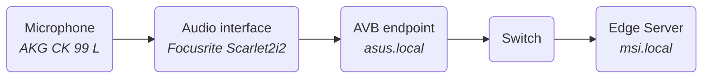
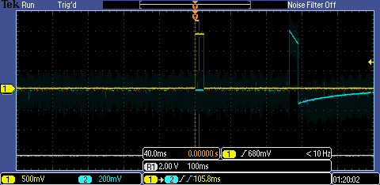
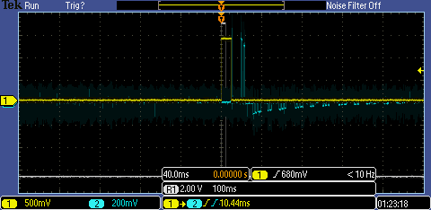
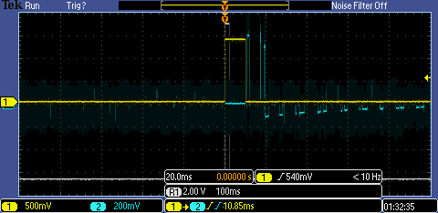

# AVB

 

sudo nice -n -20 ./avbperf -i enp3s0 -m100 -t10

sudo nice -n -20 ./avbperf -i enp3s0 -m10 -t10

sudo nice -n -20 ./avbperf -i enp3s0 -c2 -b24 -m10 -t10

sudo nice -n -20 ./avbperf -i enp3s0 -c2 -r96 -m10 -t10

