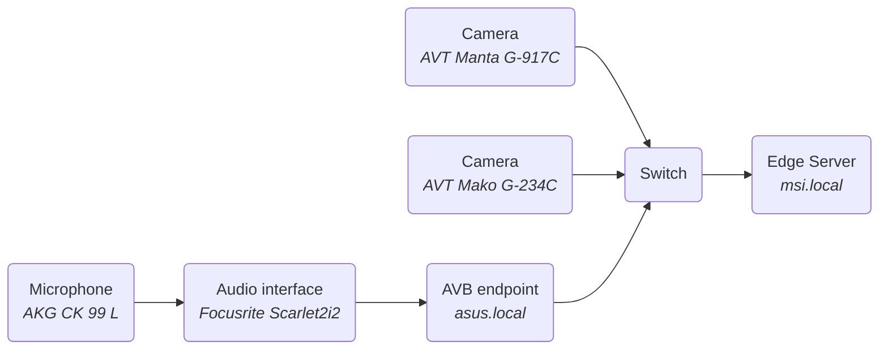

# Sync

 

```mermaid
    graph LR;

    cam1(Camera<br><i>AVT Manta G-917C<i/>);
    cam2(Camera<br><i>AVT Mako G-234C<i/>);
    akg(Microphone<br><i>AKG CK 99 L<i/>);
    foc(Audio interface<br><i>Focusrite Scarlet2i2<i/>);
    PC(AVB endpoint<br><i>asus.local<i/>);
    server(Edge Server<br><i>msi.local<i/>);
    sw(Switch<br><i><i/>);

    cam1-->sw;
    cam2-->sw;
    akg-->foc-->PC-->sw;
    sw-->server;
```

**$ sync.py --keep --index=0 --index=1 --ifname=enp3s0 --time=8 --frameRate=15 --binning=2**

<video src='./Mako-0.mov' width=180/> | <video src='./Manta-1.mp4' width=180/>

